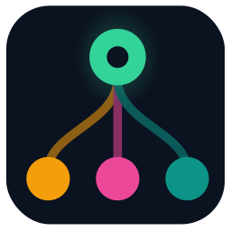
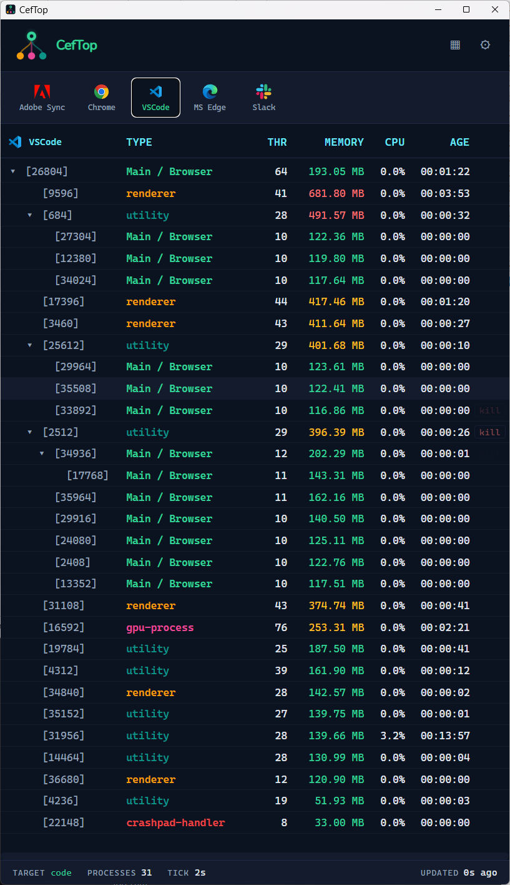

<p align="center">
  
</p>

<h1 align="center">CefTop</h1>

<p align="center">
  <a href="https://github.com/LuisPalacios/ceftop/actions/workflows/ci.yml">
    
  </a>
</p>

<p align="center">
  <strong>Map multi-process tree of any CEF, Electron, or Chromium app.</strong>
</p>

<p align="center">
  <em>Cross-platform tool for developers debugging multi-process browsers and embedded runtimes.</em>
</p>

---

## Install

One command, on macOS, Linux, or Windows (Git Bash):

```bash
bash <(curl -fsSL https://raw.githubusercontent.com/LuisPalacios/ceftop/main/scripts/bootstrap.sh)
```

The script downloads the matching release zip, installs the GUI (`/Applications/CefTopApp.app` on macOS, `~/bin/CefTopApp` on Linux, `~/bin/CefTopApp.exe` on Windows), and on Linux also drops a `.desktop` entry so CefTop shows up in Activities. Run with `--help` for options (`--version`, `--prefix`, `--no-desktop`).

> [!WARNING]
> **CefTop is not signed or notarized.** macOS Gatekeeper and Windows SmartScreen will flag the binaries. The bootstrap installer strips those flags automatically (`xattr -cr` on macOS, `Unblock-File` on Windows) so the app launches. **You are explicitly trusting unsigned code when you do this.** Audit the [source](https://github.com/LuisPalacios/ceftop) and the [bootstrap script](scripts/bootstrap.sh) before running anything.

Manual download — pick your platform from the [Releases](https://github.com/LuisPalacios/ceftop/releases) page if you prefer not to run the installer.

<p align="center">
  
</p>

## What it does

- **Pick a target** — set the executable name once (e.g. `chrome.exe`, `Code Helper`, `Slack`).
- **Tree reconstruction** — links PID to PPID and renders the parent / child hierarchy as it actually is.
- **Role parsing** — extracts the Chromium `--type=<role>` flag and labels each row (renderer, gpu-process, utility, crashpad-handler, ...). The browser / main process gets its own slot.
- **Live telemetry** — PID, PPID, thread count, and resident memory (MB) per process, refreshed on a configurable tick (1–999 s).
- **Color-coded roles** — renderers, GPU, utilities, and crash handlers get distinct colors so resource hogs jump out.
- **Surgical kill** — terminate one child or a whole root tree from the GUI. Permission errors and races come back as structured results, not silent failures.

## Stack

- **Backend**: Go 1.26+. Cross-platform process enumeration via [`shirou/gopsutil/v4`](https://github.com/shirou/gopsutil); platform-specific code only where gopsutil cannot answer.
- **Desktop runtime**: [Wails v2](https://wails.io/) for the native window and Go ↔ frontend IPC.
- **Frontend**: Svelte + TypeScript (Vite), reactive immutable snapshot store.
- **Config**: a single JSON file at `~/.config/ceftop/ceftop.json` on every platform (`$XDG_CONFIG_HOME/ceftop/` honored when set).

## Custom app icons

Drop an SVG named `app-<target>.svg` next to `ceftop.json` (e.g. `~/.config/ceftop/app-myapp.svg`) and CefTop uses it for that target — in the discovered-apps bar and in the tree header. A user-supplied `app-default.svg` overrides the bundled fallback. Lookup order: private file → bundled `/app-icons/app-<target>.svg` → default.

## Develop

Once after a fresh clone:

```bash
cd cmd/gui/frontend && npm install && cd -
cp assets/appicon.png cmd/gui/build/appicon.png
cp assets/favicon.ico cmd/gui/build/windows/icon.ico
```

Day-to-day:

```bash
# Live-reload dev loop (run from cmd/gui/)
wails dev

# Full GUI build (run from cmd/gui/)
wails build

# Sanity checks (from repo root)
go vet ./...
go test ./...
( cd cmd/gui/frontend && npm run check )
```

A bare `go build ./cmd/gui` requires `cmd/gui/frontend/dist/` to exist — populate it with `npm run build` from `cmd/gui/frontend/` first. `wails dev` and `wails build` handle that automatically.

## Repository layout

```text
cmd/gui/                 Wails GUI binary (CefTopApp)
  main.go, app.go        Window options, exported bindings
  wails.json             Wails build metadata
  frontend/              Svelte + Vite project
pkg/
  config/                Config schema, OS-aware load/save
  process/               Cross-platform discovery, role parsing, kill
.github/workflows/ci.yml Tagged-release pipeline (Win amd64+arm64, macOS arm64+amd64, Linux amd64)
scripts/
  bootstrap.sh           One-liner installer
  ceftop-cli.ps1         Original PowerShell prototype (reference)
assets/                  Icons (logo.svg, appicon.png, favicon.ico)
```

## Releasing

The CI workflow at `.github/workflows/ci.yml` triggers on `v*` tags. Push a tag and it runs the test matrix, builds the GUI on every supported platform, and uploads per-platform zips plus a `checksums.sha256` to a GitHub Release.

```bash
git tag v0.1.0
git push --tags
```

## License

Not yet declared.
